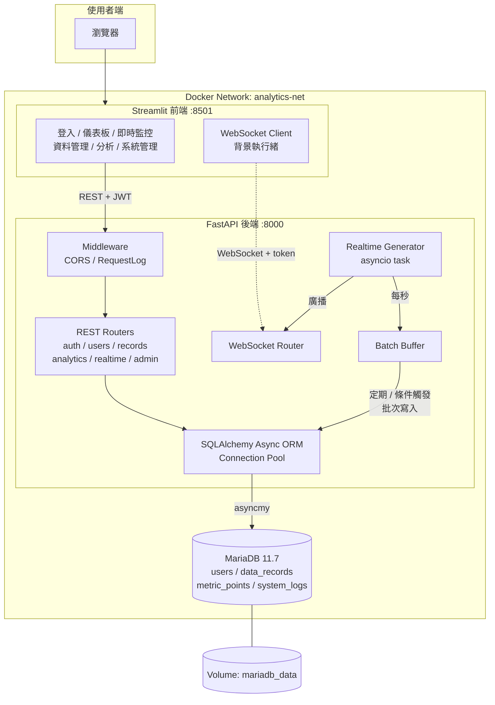

# 即時資料分析與監控系統 (Realtime Analytics & Monitoring Platform)

一套以 **FastAPI + Streamlit + MariaDB + Docker** 打造的全端即時資料分析與監控系統，
提供 JWT 認證、角色權限控管、資料 CRUD、CSV/JSON 批量匯入、WebSocket 即時推送、
異常告警、統計分析與 Excel 報表下載，並具備完整的系統管理後台。


---

## 目錄

- [專案介紹](#專案介紹)
- [功能總覽](#功能總覽)
- [技術棧說明](#技術棧說明)
- [系統架構圖](#系統架構圖)
- [專案結構](#專案結構)
- [本地運行步驟](#本地運行步驟)
- [Docker 部署指令](#docker-部署指令)
- [API 文件連結](#api-文件連結)
- [測試帳號資訊](#測試帳號資訊)
- [測試資料 CSV 範例](#測試資料-csv-範例)
- [環境變數說明](#環境變數說明)
- [資料庫遷移 (Alembic)](#資料庫遷移-alembic)
- [執行測試](#執行測試)
- [常見問題](#常見問題)

---

## 專案介紹

本系統模擬工廠 / IoT 場域的「即時資料收集 → 監控告警 → 歷史分析」完整流程：

1. **後端** 以 FastAPI 提供 RESTful API 與 WebSocket 通道，全非同步（async/await）處理。
2. **資料層** 使用 **SQLAlchemy 2.0 Async ORM**，全程以 ORM 操作資料庫，**未使用任何原生 SQL**，
   搭配 Alembic 進行版本化遷移、Engine 連接池管理、asyncmy 非同步驅動。
3. **即時模組** 由背景 asyncio 任務每秒模擬產生感測器資料，透過 WebSocket 廣播給前端，
   同時寫入記憶體緩衝區，並以「**定期（時間）**」與「**條件（筆數）**」雙觸發機制批次寫入 MariaDB。
4. **前端** 以 Streamlit 多頁面架構呈現，包含登入/登出、即時圖表、資料管理、分析報表與管理後台。
5. **部署** 以 Docker Compose 編排三個容器（frontend / backend / mariadb），
   採多階段建構、非 root 使用者執行、Volume 持久化與健康檢查。

---

## 功能總覽

### 1. 使用者管理模組
- 使用者註冊（公開註冊固定為 `user` 角色，避免權限提升）
- JWT 登入（access token + refresh token）、登出、Token 換發
- 前端於 access token 過期時**自動以 refresh token 換發**並重送請求（含 token 輪替）
- 三種角色：`admin` / `user` / `viewer`
- 依角色控管 API 權限（Depends 權限守衛 + 前端 UI 守衛雙層防護）

### 2. 資料管理模組
- 建立資料記錄（標題、數值、分類、說明、時間戳）
- 查詢資料：**分頁**、關鍵字/分類/數值區間/時間範圍**篩選**、多欄位**排序**
- 更新 / 刪除資料（僅限**建立者本人或 Admin**）
- **批量匯入**：JSON API 匯入、CSV / JSON **檔案上傳**匯入（含逐列錯誤回報）

### 3. 即時監控模組
- 模擬即時資料產生器（每秒產生多個感測器隨機資料）
- WebSocket 即時推送（`/api/v1/realtime/ws?token=...`）
- 前端即時圖表更新：折線圖、柱狀圖、告警分佈圓餅圖（`st.fragment` 局部刷新）
- **資料異常告警**：數值超過上/下限時標記 `warning` / `critical` 並列入告警清單
- 即時資料批次落地至 MariaDB，支援歷史查詢

### 4. 資料分析模組
- 統計分析：總計 / 平均 / 最大 / 最小 / 筆數
- 時間範圍查詢與時間粒度（hour / day / month）趨勢分析
- 分類資料聚合（GROUP BY 以 ORM `func` 表達式實作）
- 趨勢圖表視覺化
- **Excel 報表下載**（四個工作表：資料明細 / 統計摘要 / 分類聚合 / 趨勢分析）

### 5. 系統管理模組（Admin 專用）
- 查看所有使用者列表（分頁、關鍵字、角色、狀態篩選）
- 使用者權限管理（調整角色、啟用/停用、建立、刪除）
- 系統日誌查詢（等級、關鍵字、使用者、時間範圍）
- 資料庫狀態監控（連線狀態、連接池統計、各資料表筆數、DB 伺服器時間）
- 即時資料歷史查詢與 CSV 下載、手動觸發批次寫入

---

## 技術棧說明

### 後端
| 技術 | 版本 | 用途 |
| --- | --- | --- |
| **FastAPI** | 0.115 | Web 框架、RESTful API、WebSocket、自動 OpenAPI 文件 |
| **Uvicorn** | 0.34 | ASGI 伺服器（uvloop / httptools） |
| **Pydantic / pydantic-settings** | 2.10 / 2.7 | 請求與回應資料驗證、環境設定管理 |
| **SQLAlchemy** | 2.0 (asyncio) | **ORM**（`Mapped[]` 型別註記、`select()` 查詢、關聯管理、連接池） |
| **asyncmy** | 0.2.10 | MariaDB / MySQL 非同步驅動 |
| **Alembic** | 1.14 | 資料庫版本遷移（async env.py） |
| **PyJWT** | 2.10 | JWT 簽發與驗證（HS256） |
| **bcrypt** | 4.2 | 密碼雜湊（cost factor 12） |
| **pandas / openpyxl** | 2.2 / 3.1 | Excel 報表產生 |
| **pytest / httpx** | 8.3 / 0.28 | 非同步整合測試 |

### 前端
| 技術 | 版本 | 用途 |
| --- | --- | --- |
| **Streamlit** | 1.41 | 互動式 Web UI、`st.navigation` 多頁架構、`st.session_state` 狀態管理 |
| **Plotly Express** | 5.24 | 折線圖、柱狀圖、圓餅圖等互動圖表 |
| **websocket-client** | 1.8 | 背景執行緒接收 WebSocket 即時資料 |
| **requests** | 2.32 | 呼叫後端 REST API |
| **pandas** | 2.2 | 資料整理與 CSV 匯出 |

### 資料庫與基礎設施
| 技術 | 版本 | 用途 |
| --- | --- | --- |
| **MariaDB** | 11.7 | 關聯式資料庫（utf8mb4） |
| **Docker / Docker Compose** | - | 容器化部署、多容器編排、bridge 網路、Volume 持久化 |

### 設計重點
- **全 ORM 操作**：所有查詢、聚合、統計皆以 SQLAlchemy `select()` / `func.*` 建構，無任何原生 SQL 字串。
- **非同步全鏈路**：FastAPI → SQLAlchemy AsyncSession → asyncmy → MariaDB。
- **連接池管理**：`pool_size` / `max_overflow` / `pool_recycle` / `pool_pre_ping` 皆可由環境變數調整。
- **統一錯誤處理**：自訂 `AppError` 家族 + 全域 exception handler，回應格式一致 `{"error": {"code", "message"}}`。
- **結構化日誌**：JSON 格式輸出至 stdout，並將關鍵操作寫入 `system_logs` 資料表供後台查詢。
- **安全性**：bcrypt 雜湊、JWT 型別檢查（access/refresh 不可混用）、角色權限守衛、
  上傳檔案大小/型別/筆數限制、CORS 白名單、容器以非 root 使用者執行。

---

## 系統架構圖

> 完整圖表（分層架構、ER 圖、認證時序圖、即時推送流程、權限矩陣、部署拓撲）請見 **[docs/architecture.md](docs/architecture.md)**



---

## 專案結構

```
.
├── docker-compose.yml              # 多容器編排（mariadb / backend / frontend）
├── .env.example                    # 環境變數範例
├── README.md
├── docs/
│   ├── architecture.md             # 系統架構圖（Mermaid）
│   └── api.md                      # API 端點總覽
├── samples/
│   ├── sample_records.csv          # 測試資料 CSV 範例（25 筆）
│   └── sample_records.json         # 測試資料 JSON 範例
├── backend/
│   ├── Dockerfile                  # 多階段建構
│   ├── entrypoint.sh               # 等待 DB → Alembic 遷移 → 啟動服務
│   ├── requirements.txt
│   ├── alembic.ini
│   ├── alembic/
│   │   ├── env.py                  # async 遷移環境
│   │   └── versions/               # 0001 初始結構 / 0002 撤銷 token / 0003 索引清理
│   ├── tests/                      # pytest 整合測試（auth / records / analytics
│   │                               #   / realtime / admin / permissions）
│   └── app/
│       ├── main.py                 # 應用程式進入點、lifespan
│       ├── core/                   # 設定、安全、日誌、例外、middleware
│       ├── db/                     # Base、Session（連接池）、初始化與種子資料
│       ├── models/                 # ORM 模型（User / DataRecord / MetricPoint / SystemLog）
│       ├── schemas/                # Pydantic 驗證模型
│       ├── services/               # 業務邏輯（全 ORM）、WebSocket 管理、資料產生器
│       └── api/
│           ├── deps.py             # 認證與角色權限依賴
│           ├── router.py
│           └── v1/                 # auth / users / records / analytics / realtime / admin
└── frontend/
    ├── Dockerfile
    ├── requirements.txt
    ├── app.py                      # st.navigation 入口
    ├── .streamlit/config.toml
    ├── utils/                      # API 用戶端、Session 狀態、WebSocket 串流
    └── views/                      # login / dashboard / realtime / records / analytics / profile / admin
```

---

## 本地運行步驟

### 前置需求
- Python 3.12+
- MariaDB 11.7（或使用 Docker 只啟動資料庫）
- Git

### 1. 取得專案

```bash
git clone https://github.com/a9781ht/Realtime-Analytics-Monitoring-Platform.git
cd Realtime-Analytics-Monitoring-Platform
```

### 2. 建立環境變數檔

```bash
# Linux / macOS
cp .env.example .env

# Windows PowerShell
Copy-Item .env.example .env
```

編輯 `.env`，**務必修改 `SECRET_KEY`**：

```bash
python -c "import secrets; print(secrets.token_urlsafe(64))"
```

本地（非容器）執行時，請將 `.env` 中的主機位址改為 `localhost`：

```dotenv
DB_HOST=localhost
API_BASE_URL=http://localhost:8000
WS_BASE_URL=ws://localhost:8000
```

### 3. 啟動資料庫（僅用 Docker 跑 MariaDB）

```bash
docker compose up -d mariadb
```

或使用既有的 MariaDB，並建立資料庫：

```sql
CREATE DATABASE analytics CHARACTER SET utf8mb4 COLLATE utf8mb4_unicode_ci;
CREATE USER 'analytics'@'%' IDENTIFIED BY 'analytics_pw_change_me';
GRANT ALL PRIVILEGES ON analytics.* TO 'analytics'@'%';
FLUSH PRIVILEGES;
```

### 4. 啟動後端

```bash
cd backend
python -m venv .venv

# Linux / macOS
source .venv/bin/activate
# Windows PowerShell
.\.venv\Scripts\Activate.ps1

pip install -r requirements.txt

# 執行資料庫遷移
alembic upgrade head

# 啟動開發伺服器
uvicorn app.main:app --reload --host 0.0.0.0 --port 8000
```

啟動後可開啟 <http://localhost:8000/docs> 檢視 Swagger 文件。

### 5. 啟動前端（另開一個終端機）

```bash
cd frontend
python -m venv .venv

# Linux / macOS
source .venv/bin/activate
# Windows PowerShell
.\.venv\Scripts\Activate.ps1

pip install -r requirements.txt

# 指定後端位址（Windows PowerShell）
$env:API_BASE_URL="http://localhost:8000"
$env:WS_BASE_URL="ws://localhost:8000"

# Linux / macOS
# export API_BASE_URL=http://localhost:8000
# export WS_BASE_URL=ws://localhost:8000

streamlit run app.py
```

開啟 <http://localhost:8501> 即可使用系統。

---

## Docker 部署指令

### 一鍵啟動全系統

```bash
# 1. 準備環境變數
cp .env.example .env          # Windows: Copy-Item .env.example .env

# 2. 建構並啟動全部容器（背景執行）
docker compose up -d --build

# 3. 檢視啟動狀態
docker compose ps
```

啟動完成後：

| 服務 | 網址 |
| --- | --- |
| Streamlit 前端 | <http://localhost:8501> |
| FastAPI 後端 | <http://localhost:8000> |
| Swagger API 文件 | <http://localhost:8000/docs> |
| ReDoc API 文件 | <http://localhost:8000/redoc> |
| 健康檢查 | <http://localhost:8000/health> |

### 常用維運指令

```bash
# 查看即時日誌
docker compose logs -f                # 全部服務
docker compose logs -f backend        # 僅後端
docker compose logs -f frontend       # 僅前端

# 重新建構單一服務
docker compose build backend
docker compose up -d backend

# 重啟服務
docker compose restart backend

# 進入容器
docker compose exec backend sh
docker compose exec mariadb mariadb -u analytics -p analytics

# 在容器內執行資料庫遷移
docker compose exec backend alembic upgrade head
docker compose exec backend alembic current
docker compose exec backend alembic history

# 在容器內執行測試
docker compose exec backend pytest -v

# 停止服務（保留資料）
docker compose stop

# 移除容器與網路（保留 Volume 資料）
docker compose down

# 危險：移除容器與所有資料（含資料庫 Volume）
docker compose down -v

# 查看資源使用
docker stats analytics-backend analytics-frontend analytics-mariadb
```

### 容器設計說明

| 項目 | 說明 |
| --- | --- |
| 多階段建構 | `builder` 階段安裝編譯相依並建立 venv，`runtime` 階段僅複製 `/opt/venv`，映像更精簡 |
| 非 root 執行 | 兩個應用容器皆建立 `appuser` (uid 1000) 並以其身分執行 |
| 容器間通訊 | 自訂 bridge 網路 `analytics-net`，以服務名稱 `mariadb` / `backend` 互連 |
| Volume 持久化 | `mariadb_data`（資料庫檔案）、`backend_logs`（後端日誌） |
| 健康檢查 | MariaDB `healthcheck.sh`、後端 `/health`、前端 `/_stcore/health` |
| 啟動順序 | `backend` 以 `depends_on: condition: service_healthy` 等待資料庫就緒 |
| 環境變數 | 全部由 `.env` 注入，`SECRET_KEY` 未設定時 compose 會直接報錯 |

---

## API 文件連結

| 文件 | 連結 | 說明 |
| --- | --- | --- |
| **Swagger UI** | <http://localhost:8000/docs> | 互動式 API 文件，可直接測試（右上 **Authorize** 輸入帳密即可帶入 JWT） |
| **ReDoc** | <http://localhost:8000/redoc> | 閱讀導向的 API 文件 |
| **OpenAPI JSON** | <http://localhost:8000/openapi.json> | OpenAPI 3.1 規格檔（可匯入 Postman / Insomnia） |
| **端點總覽** | [docs/api.md](docs/api.md) | 所有端點、權限需求與範例 |

### RESTful 端點速覽

| 方法 | 路徑 | 權限 | 說明 |
| --- | --- | --- | --- |
| POST | `/api/v1/auth/register` | 公開 | 使用者註冊 |
| POST | `/api/v1/auth/login` | 公開 | 登入取得 JWT |
| POST | `/api/v1/auth/refresh` | 公開 | 換發 access token |
| GET | `/api/v1/auth/me` | 已登入 | 取得個人資訊 |
| GET | `/api/v1/records` | 已登入 | 查詢資料（分頁/篩選/排序） |
| POST | `/api/v1/records` | admin, user | 建立資料 |
| PATCH | `/api/v1/records/{id}` | 建立者 / admin | 部分更新 |
| DELETE | `/api/v1/records/{id}` | 建立者 / admin | 刪除 |
| POST | `/api/v1/records/import` | admin, user | 上傳 CSV / JSON 批量匯入 |
| GET | `/api/v1/analytics/summary` | 已登入 | 統計摘要 |
| GET | `/api/v1/analytics/trend` | 已登入 | 趨勢分析 |
| GET | `/api/v1/analytics/export` | 已登入 | 下載 Excel 報表 |
| WS | `/api/v1/realtime/ws?token=` | 已登入 | WebSocket 即時推送 |
| GET | `/api/v1/realtime/metrics` | admin | 即時資料歷史查詢 |
| GET | `/api/v1/users` | admin | 使用者列表 |
| PATCH | `/api/v1/users/{id}/role` | admin | 調整角色 |
| GET | `/api/v1/admin/logs` | admin | 系統日誌 |
| GET | `/api/v1/admin/database` | admin | 資料庫狀態監控 |

### WebSocket 連線範例

```javascript
const ws = new WebSocket("ws://localhost:8000/api/v1/realtime/ws?token=<ACCESS_TOKEN>");
ws.onmessage = (e) => console.log(JSON.parse(e.data));
// {"type":"metrics","timestamp":"...","payload":[{"sensor_id":"SENSOR-01","value":72.3,"is_alert":false,...}]}
```

---

## 測試帳號資訊

系統首次啟動時（資料庫為空且 `SEED_DEMO_USERS=true`）會自動建立以下帳號與 40 筆示範資料：

| 角色 | 帳號 | 密碼 | 權限說明 |
| --- | --- | --- | --- |
| **Admin** | `admin` | `Admin@1234` | 全部功能：資料 CRUD（所有人的資料）、使用者管理、系統日誌、資料庫監控 |
| **User** | `user` | `User@1234` | 資料 CRUD（僅限自己建立的資料）、批量匯入、分析報表 |
| **Viewer** | `viewer` | `Viewer@1234` | 唯讀：僅可查詢資料、檢視即時監控與分析報表 |

> **安全提醒**：以上為開發/展示用帳號。正式環境請於 `.env` 設定 `SEED_DEMO_USERS=false`，
> 並修改 `ADMIN_PASSWORD` 與 `SECRET_KEY`。

Admin 帳號可透過 `.env` 自訂：

```dotenv
ADMIN_USERNAME=admin
ADMIN_EMAIL=admin@example.com
ADMIN_PASSWORD=Admin@1234
```

---

## 測試資料 CSV 範例

範例檔位於 [`samples/sample_records.csv`](samples/sample_records.csv)（25 筆）與
[`samples/sample_records.json`](samples/sample_records.json)（5 筆）。

### CSV 格式

| 欄位 | 必填 | 型別 | 說明 |
| --- | --- | --- | --- |
| `title` | 是 | string(200) | 資料標題 |
| `value` | 是 | float | 數值 |
| `category` | 是 | string(50) | 分類 |
| `description` | 否 | string | 說明 |
| `recorded_at` | 否 | datetime | 資料時間（`YYYY-MM-DD HH:MM:SS`），留空則為匯入當下時間 |

```csv
title,value,category,description,recorded_at
生產線A-爐溫,78.42,temperature,早班第一次量測,2026-08-01 08:00:00
無塵室濕度,45.60,humidity,空調正常,2026-08-01 08:30:00
主軸振動值,93.05,vibration,異常震動已通報,2026-08-02 15:20:00
```

### 匯入方式

**方式一：前端介面** — 登入後前往「資料管理 → 批量匯入」，上傳檔案後點擊「開始匯入」。

**方式二：API（curl）**

```bash
# 1. 登入取得 token
TOKEN=$(curl -s -X POST http://localhost:8000/api/v1/auth/login \
  -H "Content-Type: application/json" \
  -d '{"username":"admin","password":"Admin@1234"}' | python -c "import sys,json;print(json.load(sys.stdin)['access_token'])")

# 2. 上傳 CSV
curl -X POST http://localhost:8000/api/v1/records/import \
  -H "Authorization: Bearer $TOKEN" \
  -F "file=@samples/sample_records.csv"

# 回應：{"inserted":25,"failed":0,"errors":[]}
```

---

## 環境變數說明

完整清單請見 [`.env.example`](.env.example)，重點項目：

| 變數 | 預設值 | 說明 |
| --- | --- | --- |
| `SECRET_KEY` | — | **必填**，JWT 簽章金鑰 |
| `ACCESS_TOKEN_EXPIRE_MINUTES` | 120 | Access Token 有效分鐘數 |
| `DB_HOST` / `DB_PORT` / `DB_NAME` | mariadb / 3306 / analytics | 資料庫連線 |
| `DB_POOL_SIZE` / `DB_MAX_OVERFLOW` | 10 / 20 | SQLAlchemy 連接池 |
| `DB_POOL_RECYCLE` | 1800 | 連線回收秒數（避免 MariaDB 斷線） |
| `GENERATOR_ENABLED` | true | 是否啟用即時資料產生器 |
| `GENERATOR_INTERVAL_SECONDS` | 1 | 每幾秒產生一批資料 |
| `GENERATOR_FLUSH_INTERVAL` | 5 | **定期**批次寫入間隔（秒） |
| `GENERATOR_FLUSH_SIZE` | 50 | **條件觸發**批次寫入的緩衝筆數門檻 |
| `ALERT_THRESHOLD_HIGH` / `LOW` | 90 / 10 | 異常告警上下限 |
| `BACKEND_CORS_ORIGINS` | http://localhost:8501 | CORS 白名單（逗號分隔） |
| `RATE_LIMIT_GENERAL` / `LOGIN` | 120 / 5 | 每個時間窗允許的一般請求數 / 登入失敗次數 |
| `RATE_LIMIT_WINDOW_SECONDS` | 60 | 速率限制時間窗長度（秒） |
| `API_BASE_URL` / `WS_BASE_URL` | http://backend:8000 | 前端呼叫後端位址 |

---

## 資料庫遷移 (Alembic)

```bash
cd backend

# 套用所有遷移
alembic upgrade head

# 查看目前版本 / 歷史
alembic current
alembic history --verbose

# 修改 ORM 模型後自動產生遷移
alembic revision --autogenerate -m "add new column"

# 回退一版
alembic downgrade -1
```

> 容器啟動時 `entrypoint.sh` 會自動等待資料庫就緒並執行 `alembic upgrade head`；
> 遷移失敗會直接中止啟動，避免以不完整的結構繼續執行。
> **資料表結構一律由 Alembic 管理**，應用程式啟動時不會自動建表。

資料表一覽：

| 資料表 | 說明 |
| --- | --- |
| `users` | 使用者（帳號、bcrypt 密碼雜湊、角色、啟用狀態） |
| `data_records` | 資料記錄（標題、數值、分類、時間戳、建立者外鍵） |
| `metric_points` | 即時監控資料（感測器、數值、告警等級、產生時間） |
| `system_logs` | 系統日誌（等級、動作、路徑、狀態碼、耗時、使用者） |
| `revoked_tokens` | 已撤銷的 JWT（登出與 refresh 輪替後失效的 token） |

---

## 執行測試

```bash
cd backend
pytest -v

# 或在容器內執行
docker compose exec backend pytest -v
```

測試使用 SQLite（aiosqlite）記憶體資料庫，不需連線 MariaDB，共 53 個測試涵蓋：

| 測試檔 | 涵蓋範圍 |
| --- | --- |
| `test_auth.py` | 註冊 / 登入 / Token 驗證 / 登出撤銷 / 重複帳號衝突 |
| `test_records.py` | 資料 CRUD、分頁查詢、**跨使用者權限阻擋**（403）、批量匯入 |
| `test_analytics.py` | 統計摘要、分類聚合、趨勢（day / month）、時間範圍查詢、Excel 匯出內容 |
| `test_realtime.py` | 告警閾值判定、資料產生器、WebSocket 連線管理與失效連線清除、WS 認證、歷史查詢權限 |
| `test_admin.py` | 使用者列表 / 角色調整 / 停用、系統日誌、資料庫狀態監控、非 Admin 阻擋 |
| `test_permissions.py` | Viewer 唯讀、Admin 跨使用者操作、角色提升防護、Refresh Token 輪替與重放阻擋 |

---

## 常見問題

<details>
<summary><b>Q1. 啟動時後端一直顯示「資料庫尚未就緒」？</b></summary>

MariaDB 首次初始化需要 20~40 秒。後端具備自動重試（最多 60 次、每次 2 秒）與 `depends_on: service_healthy`。
若仍失敗，請檢查 `docker compose logs mariadb` 及 `.env` 的帳密設定是否與 Volume 內既有資料一致
（更換密碼後需執行 `docker compose down -v` 重建 Volume）。
</details>

<details>
<summary><b>Q2. 前端即時監控頁顯示「未連線」？</b></summary>

1. 確認 `.env` 的 `WS_BASE_URL` 正確（容器內為 `ws://backend:8000`，本機執行為 `ws://localhost:8000`）。
2. 確認 `GENERATOR_ENABLED=true`。
3. 點擊頁面上的「連線」按鈕重新建立連線。
4. 可用 `GET /api/v1/realtime/status` 確認產生器是否運作中。
</details>

<details>
<summary><b>Q3. 為什麼一般使用者無法修改別人的資料？</b></summary>

這是刻意的權限設計。`record_service.ensure_can_modify()` 會檢查
「操作者是 Admin」或「操作者為資料建立者」，否則回傳 403。
</details>

<details>
<summary><b>Q4. 即時資料多久寫入資料庫一次？</b></summary>

雙觸發機制：
- **定期觸發**：每 `GENERATOR_FLUSH_INTERVAL` 秒（預設 5 秒）寫入一次。
- **條件觸發**：緩衝區累積達 `GENERATOR_FLUSH_SIZE` 筆（預設 50 筆）立即寫入。
- Admin 亦可於系統管理頁點擊「立即批次寫入」或呼叫 `POST /api/v1/realtime/flush`。
</details>

<details>
<summary><b>Q5. 專案有使用原生 SQL 嗎？</b></summary>

沒有。所有資料庫操作皆透過 SQLAlchemy ORM 完成，包含統計聚合（`func.sum` / `func.avg` /
`func.count` / `group_by`）與時間分組（`func.date_format`）。可用
`grep -rn "text(\|execute(\"" backend/app` 驗證。
</details>

---

## 授權

MIT License
