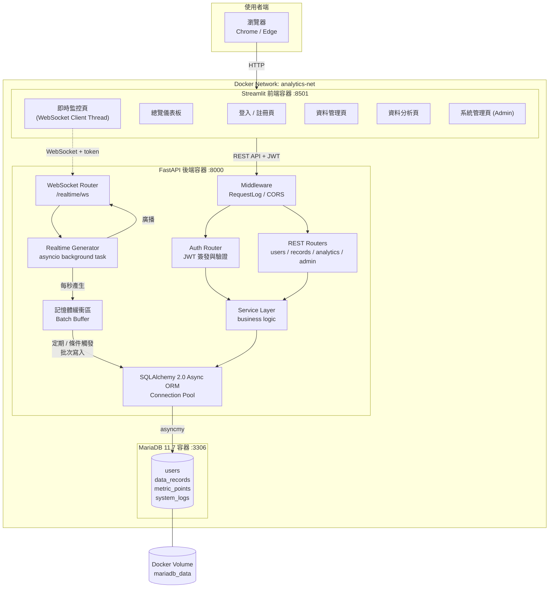
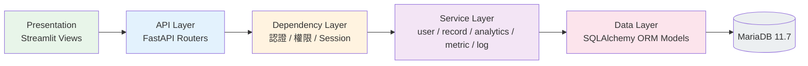
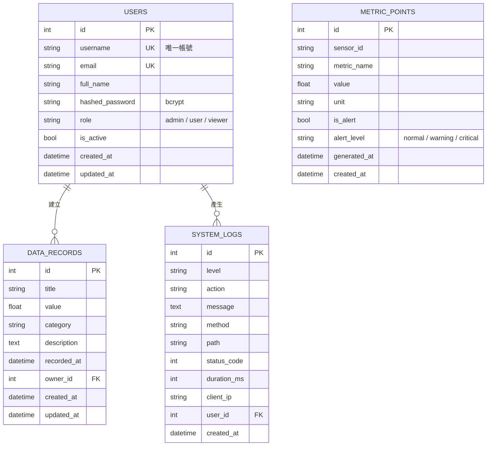
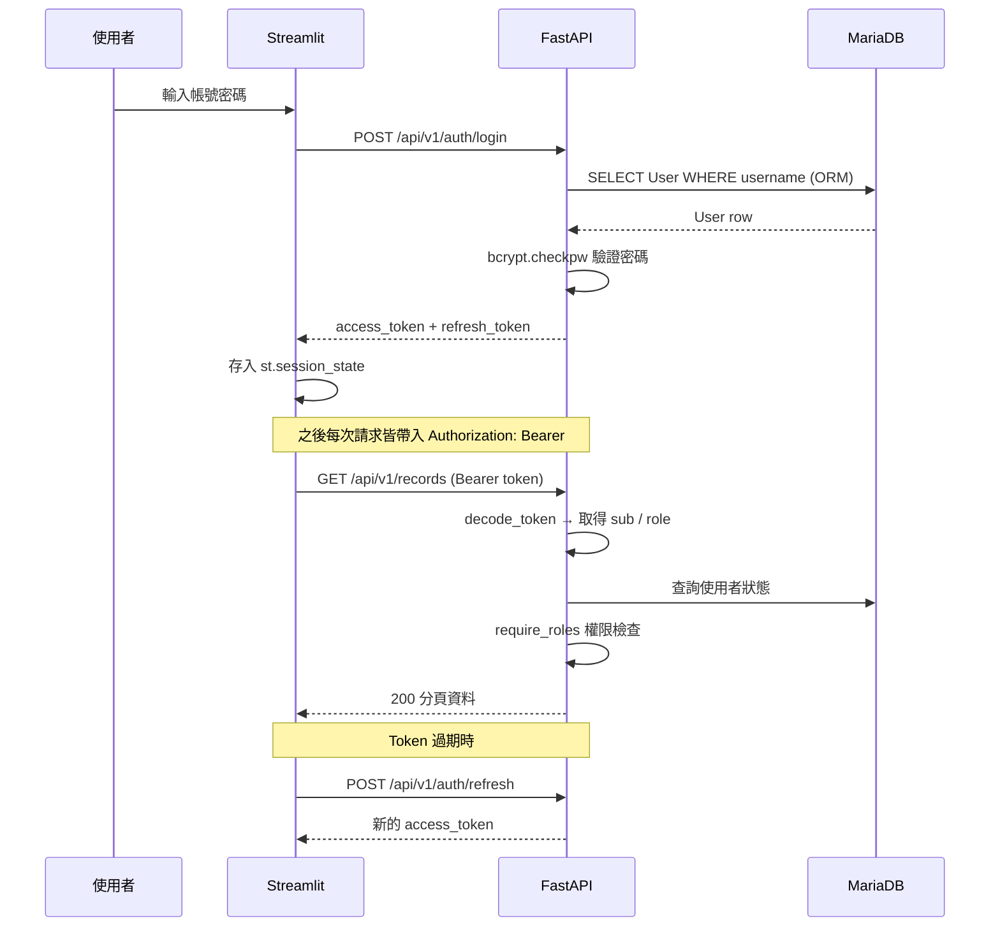
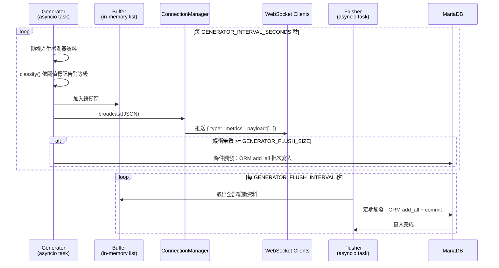
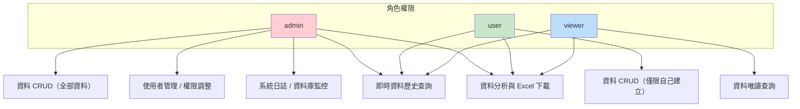
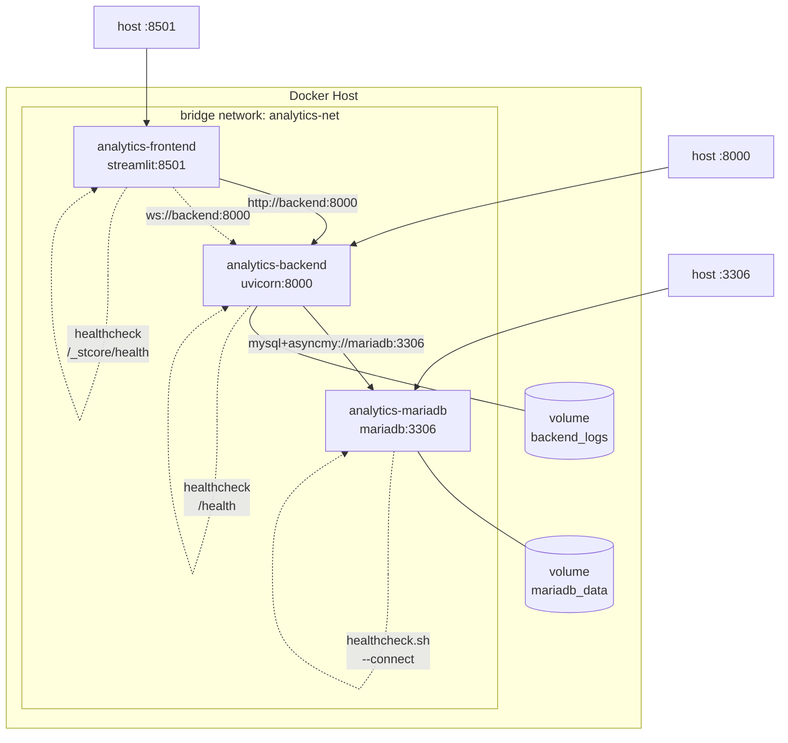

# 系統架構文件

> 本文件所有圖表以 [Mermaid](https://mermaid.js.org/) 撰寫，GitHub 可直接渲染。

---

## 1. 系統整體架構圖

---

## 2. 分層架構

---

## 3. 資料庫 ER 圖

---

## 4. JWT 認證流程

---

## 5. 即時資料推送與批次寫入流程

---

## 6. 權限矩陣

---

## 7. 容器部署拓撲

---

## 8. 技術決策說明

| 項目 | 選擇 | 理由 |
| --- | --- | --- |
| ORM | SQLAlchemy 2.0 Async | 需求明確禁止原生 SQL；2.0 typing 支援佳，`Mapped[]` 型別安全 |
| DB Driver | asyncmy | MariaDB / MySQL 的高效能 asyncio 驅動，與 SQLAlchemy async 相容 |
| 遷移 | Alembic（async env） | 版本化 schema 管理，容器啟動時自動 `upgrade head` |
| 密碼雜湊 | bcrypt (cost=12) | 業界標準、抗暴力破解；避免 passlib 版本相依問題 |
| Token | PyJWT (HS256) | 無狀態認證，access + refresh 雙 token |
| 即時推送 | FastAPI WebSocket + asyncio task | 與 API 共用事件迴圈，免額外 broker |
| 批次寫入 | 記憶體緩衝 + 雙觸發 | 降低單筆 INSERT 造成的 IO 壓力 |
| 前端 | Streamlit `st.navigation` | 原生多頁架構、`st.fragment(run_every)` 局部刷新不整頁重載 |
| 容器 | 多階段建構 + 非 root 使用者 | 縮小映像體積、降低安全風險 |
